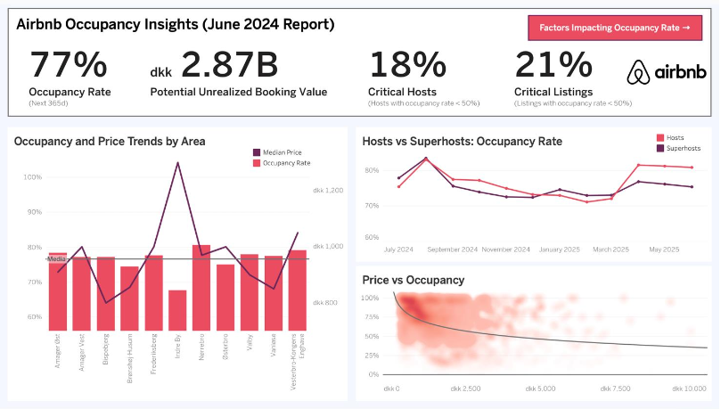
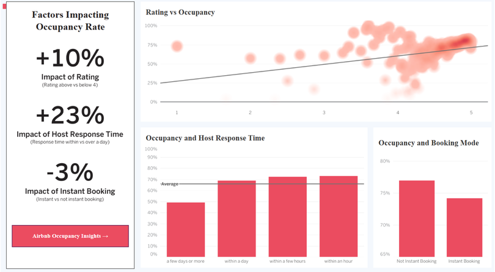

# 🏘️ Airbnb Listings Occupancy Analysis  
**Data-Driven Insights to Improve Listing Performance**

---

## 📌 Overview

This project explores how data can be used to understand and improve the **occupancy performance of short-term rental listings**.

By analyzing large-scale Airbnb data, the goal is to identify the key factors that influence how often listings are booked and uncover actionable strategies to increase overall platform performance.

The analysis focuses on **Copenhagen listings**, using structured data workflows and visual analytics to translate raw data into business insights.

---

## 🎯 Objective

The main objective is to understand:

> How can occupancy rates be improved to increase booking activity and overall value generated from listings?

Occupancy plays a central role, as it directly impacts the number of nights booked and the overall economic performance of the platform :contentReference[oaicite:0]{index=0}.

---

## 📊 Key Insights

- 📉 **Price vs Occupancy** → Higher prices tend to reduce booking frequency  
- ⭐ **Ratings Matter** → Better reviews are linked to higher occupancy  
- ⏱️ **Fast Responses Win** → Quick host replies increase booking likelihood  
- 🔁 **Booking Experience** → Communication influences guest decisions  
- 📅 **Seasonality** → Demand fluctuates across the year  

A relevant share of listings remains underutilized, suggesting strong room for improvement.

---

## 🧠 Approach

- Data exploration and cleaning using Python  
- Handling missing values and inconsistencies  
- Building a structured analytical database  
- Creating visual dashboards to highlight patterns  
- Interpreting results with clear assumptions  

A key assumption used is that **unavailable listings are considered booked**, providing a consistent proxy for occupancy :contentReference[oaicite:1]{index=1}.

---

## 📊 Occupancy Insights

This view highlights the overall performance of listings and shows:

- Average occupancy around **77%**
- Strong **negative relationship between price and occupancy**
- Clear **seasonal patterns** in demand
- Differences across neighborhoods  

It also reveals significant **unrealized value from unbooked nights**, pointing to optimization opportunities.

---

## 🔍 Drivers of Occupancy

Beyond pricing, several factors influence performance:

- ⭐ Higher ratings → higher occupancy  
- ⏱️ Faster response times → better booking outcomes  
- 🔁 Communication and trust → key in decision-making  

These insights show that improving user experience can be as impactful as pricing changes.

---

## 🗂️ Data

The analysis is based on:

- Listing data (properties, hosts, attributes)  
- Calendar data (availability and prices over time)  
- Review data (user feedback and ratings)  

Together, these sources provide a complete view of listing performance.

---

## 💡 Key Takeaways

- Pricing is important, but not the only lever  
- Host behavior and listing quality play a major role  
- Small improvements can lead to meaningful gains  
- There is large untapped potential in existing listings :contentReference[oaicite:2]{index=2}  

---

## 🛠️ Tools & Technologies

- Python (Pandas)  
- SQL & PostgreSQL  
- Tableau  
- Data visualization & modeling  

---

## 🚀 Final Thoughts

This project demonstrates how combining **data engineering, analytics, and visualization** can generate actionable insights.

Improving occupancy requires balancing **pricing strategies with user experience and host performance**, unlocking value across the platform.
